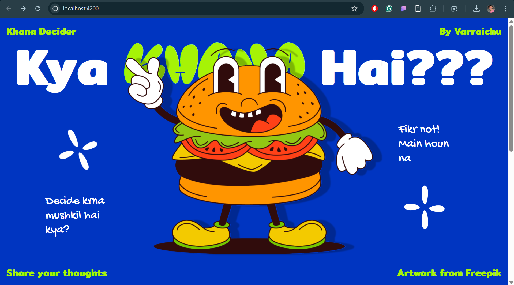
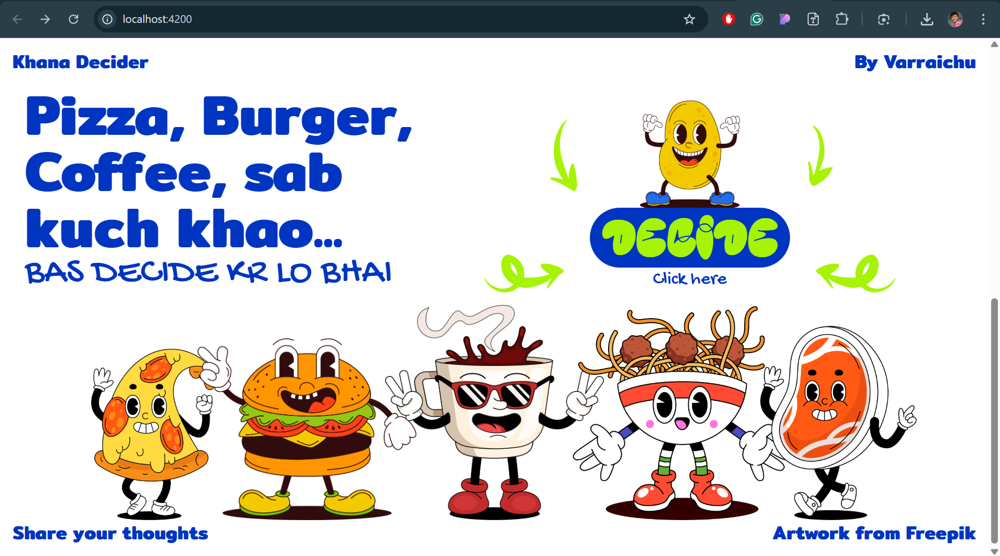
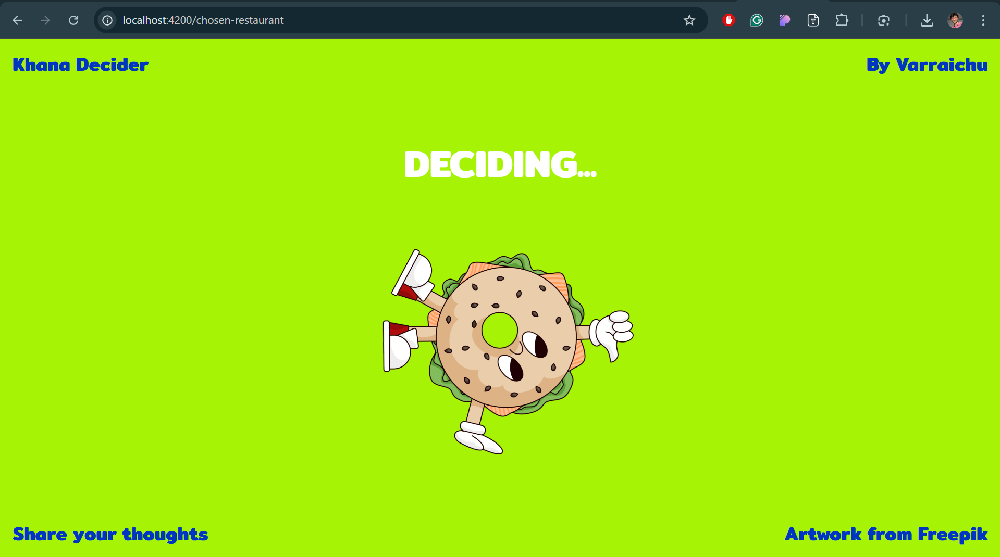
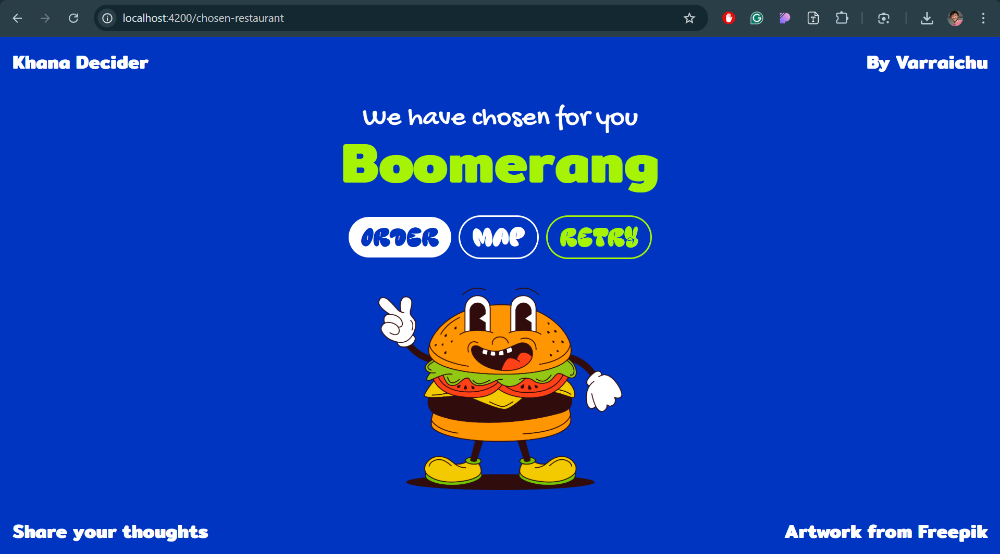

# Kya-Khana-Hai

**Kya-Khana-Hai** is a web application designed to help indecisive people and their friends decide what to eat. 
We've all had plans with our friends only for us to sit their an hour trying to decide what to eat. And lets not pretend it's only a ME issue! You have suffered from this as well!
I got tired and decided to make this website so that our brains don't have to do the heavy lifting and we can focus on the eating part lol
It randomly selects a restaurant from a curated list and provides links to order food or view the location on maps.

## Features
- Fetches a list of restaurants stored in MongoDB from a Flask backend
- Randomly selects a restaurant
- Provides quick links to order food or get directions
- Simple and clean UI with loading states

## Tech Stack
### Frontend
- **Angular** (with Standalone Components)
- **Tailwind CSS** (for styling)

### Backend
- **Flask** (serves restaurant data)
---

## Getting Started

### Backend (Flask Server)

#### Prerequisites
- Python 3.x
- Flask

#### Installation
1. Clone the repository:
   ```bash
   git clone https://github.com/your-username/Kya-Khana-Hai.git
   cd Kya-Khana-Hai/backend
   ```
2. Create a virtual environment:
   ```bash
   python -m venv env
   source env/bin/activate  # On Windows: env\Scripts\activate
   ```
3. Install dependencies:
   ```bash
   pip install -r requirements.txt
   ```
4. Run the Flask server:
   ```bash
   python app.py
   ```
   ```bash
   flask run --debug
   ```
   The server should be running at `http://127.0.0.1:5000/`

---

### Frontend (Angular App)

#### Prerequisites
- Node.js and npm installed
- Angular CLI installed globally (`npm install -g @angular/cli`)

#### Installation
1. Navigate to the frontend directory:
   ```bash
   cd ../frontend
   ```
2. Install dependencies:
   ```bash
   npm i
   ```
3. Start the development server:
   ```bash
   npm start
   ```
   The frontend should be running at `http://localhost:4200/`

---

## Frontend Directory Structure
```
frontend/
│── src/
│   ├── app/
│   │   ├── app.component.css
│   │   ├── app.component.html
│   │   ├── app.component.spec.ts
│   │   ├── app.component.ts
│   │   ├── app.config.ts
│   │   ├── app.routes.ts
│   ├── assets/
│   │   ├── fonts/
│   │   │   ├── GochiHand/
│   │   │   ├── Kelsi/
│   │   │   ├── Mitr/
│   │   ├── images/
│   ├── components/
│   │   ├── footer/
│   │   │   ├── footer.component.html
│   │   │   ├── footer.component.ts
│   │   ├── header/
│   │   ├── loading/
│   ├── pages/
│   │   ├── decide/
│   │   ├── landing/
│   ├── Restaurant/
│   │   ├── ChosenRestaurant.component.ts
│   │   ├── ChosenRestaurant.component.html
│   │   ├── restaurant.service.ts
│   ├── index.html
│   ├── main.ts
```

---

## API Endpoints
- **GET** `/api/get-restaurants` → Returns a list of restaurants

Example response:
```json
[
    { "name": "Pizza Place", "order": "https://foodpanda.com/pizza", "location": "https://maps.com/pizza" },
    { "name": "Sushi Spot", "order": "https://foodpanda.com/sushi", "location": "https://maps.com/sushi" }
]
```

---

## Screenshots

1. **Homepage:**



2. **Loading state:**


3. **Randomly Selected Restaurant:**


---
## Future Plans
I plan to implement a web scraper that scrapes the Foodpanda website and directly adds the restaurant data to MongoDB, eliminating the need for manual data entry.

---

## License
This project is licensed under the MIT License.

